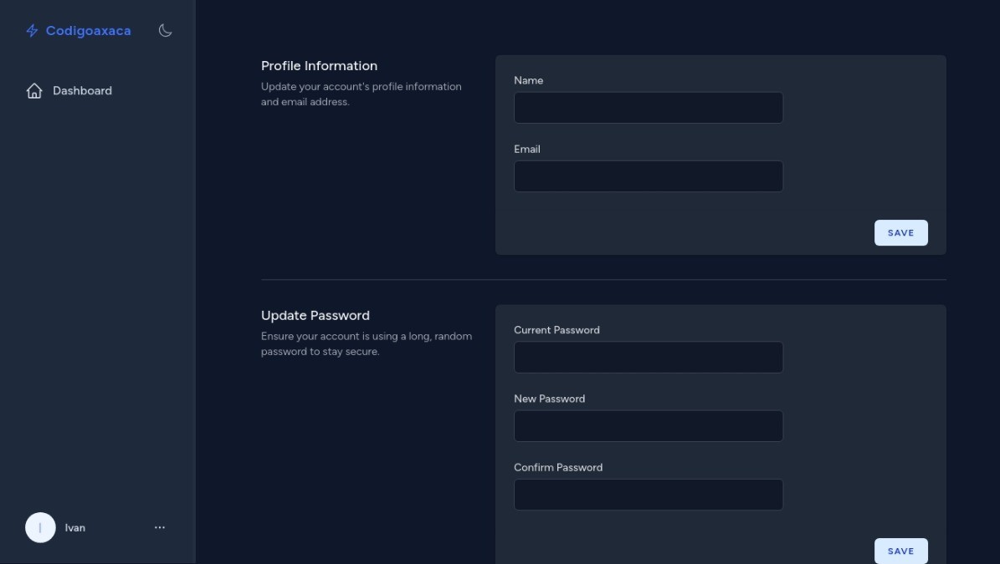
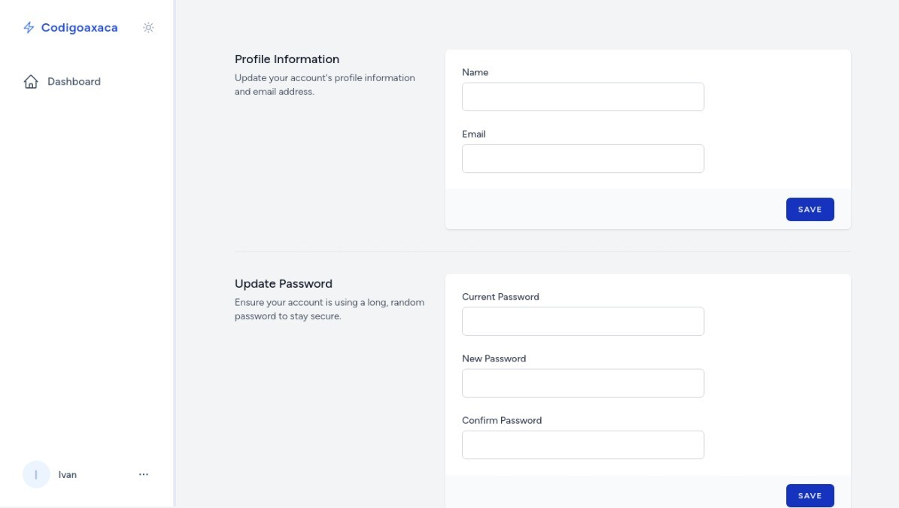

# Codigoaxaca Starter Kit

This is a starter kit for [Laravel](https://laravel.com/) projects using [Jetstream](https://jetstream.laravel.com/) with [Livewire](https://livewire.laravel.com) and [Flowbite](https://flowbite.com/).

<p>
    
</p>
<p>
    
    
</p>

## Requirements

- PHP >= 8.2

## Icons

[Blade Icons](https://blade-ui-kit.com/blade-icons) preinstalled [Heroicons](https://heroicons.com/)

```blade
@svg('heroicon-o-ellipsis-horizontal', 'hi-solid hi-dots-horizontal inline-block h-5 w-5')

<x-heroicon-o-moon class="hi-outline hi-moon hidden h-5 w-5 dark:inline-block" />
```

## Dashboard navigation

To add a new entry to the dashboard's sidebar navigation, follow the steps outlined below. This process involves updating the `navigation` array located in your application's configuration file `config/dashboard.php`.

### Add a New Entry to the Navigation Array

In the `navigation` array, each entry is an associative array that defines the properties of a navigation item. To add a new item, append a new associative array to the `navigation` array with the following keys:

- `name`: The label that will be displayed in the sidebar for this navigation item.
- `route`: The name of the route or a URL to which the navigation item will link. This should correspond to a route defined in your application's routing configuration.
- `active_route`: The route name or URL that will be used to determine if the navigation item is active. This is used for highlighting the current page in the sidebar.
- `icon`: The icon that will be displayed next to the navigation item in the sidebar. The value should correspond to a Heroicons name.

#### Example

To add a "Profile" page to the navigation with a corresponding route named `profile`, your updated `navigation` array might look like this:

```php
'navigation' => [
    [
        'name' => 'Dashboard',
        'route' => 'dashboard',
        'active_route' => 'dashboard*',
        'icon' => 'home',
    ],
    [
        'name' => 'Profile',
        'route' => 'profile.show',
        'active_route' => 'profile*',
        'icon' => 'user',
    ],
    [
        'name' => 'Url example',
        'route' => 'my-url',
        'active_route' => 'my-url',
        'icon' => 'shield-exclamation',
    ],
],
